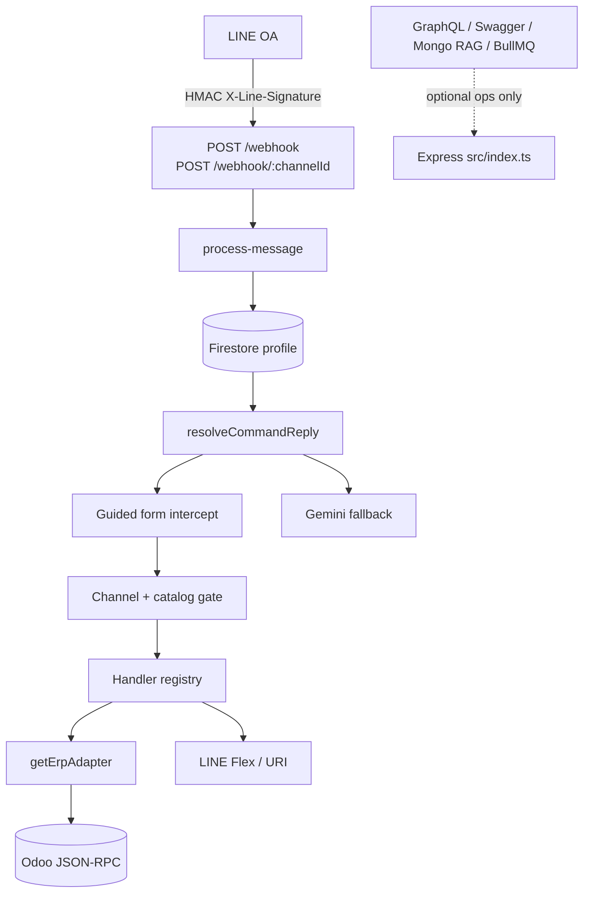
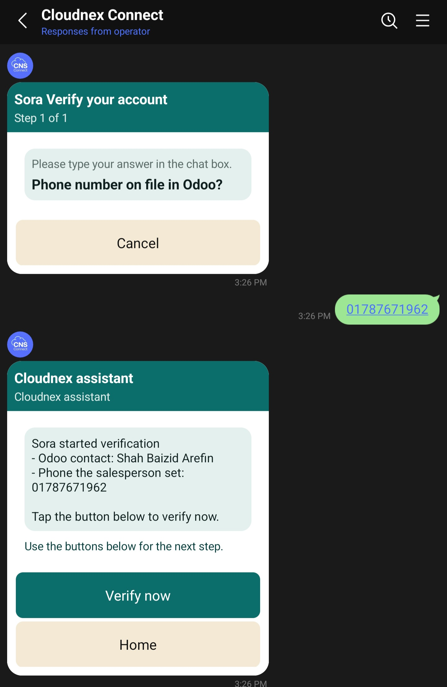
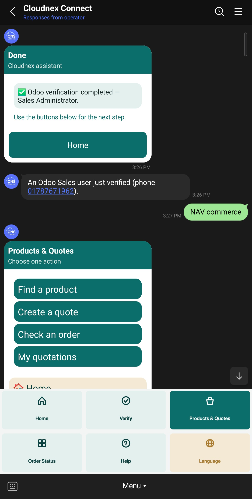
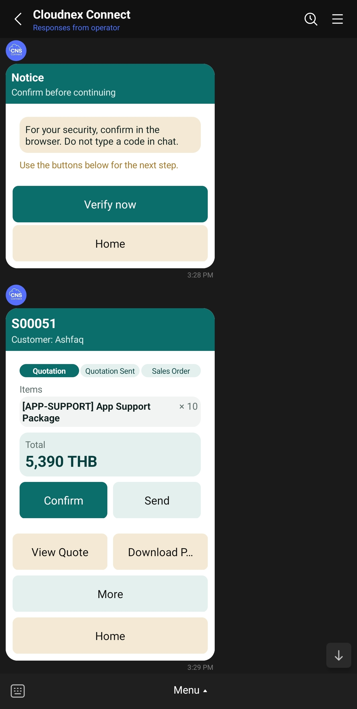
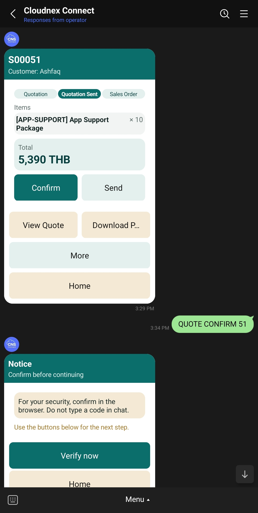
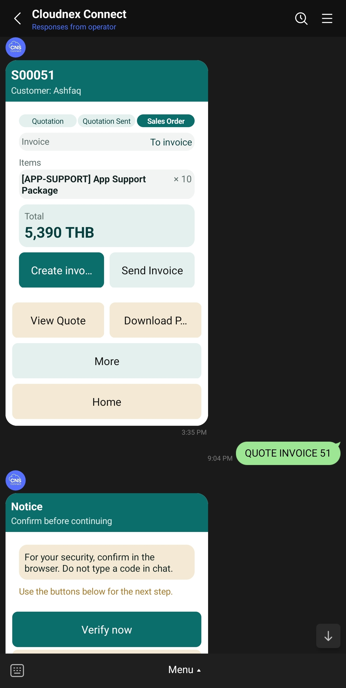
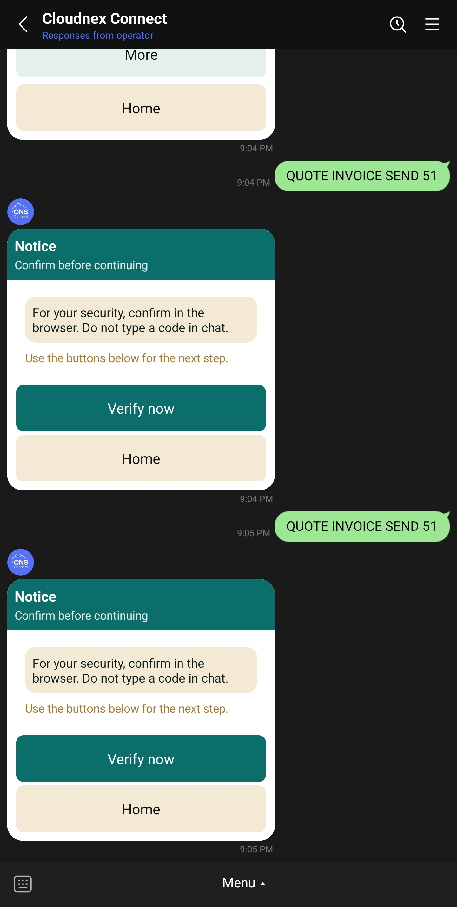

# CloudNex Connect (CNS LINE OA)

TypeScript Express backend that connects a LINE Official Account to Odoo ERP. Users work in LINE Flex cards (Thai/English). Identity lives in Firestore. Sales, partners, and products live in Odoo.

**Release:** v3.0.0 — Odoo LINE OA v2 production (bug-fix cut).  
**Runtime:** Node 22+. **Persona:** Sora / โซระ.

This README is the map. Implementation details stay in `documents/` and `CLAUDE.md`. If a document disagrees with running code, the code wins.

---

## What it does

Sales staff and customers use one Official Account:

| Persona | What they do in LINE |
|---|---|
| Guest | PDPA notice, home menu, language, help. Receive a quotation if they have added the OA. Identity VERIFY is not required just to receive a quote. |
| Customer (Odoo partner phone) | View/confirm a sent quote via Odoo portal link. VERIFY only when they take a gated chat action. |
| Sales User / Sales Administrator | VERIFY against `res.users` phone. Create/send/confirm quotes, invoices, directory and catalog (gated). Sales Admin can toggle LINE service groups (`SALES FEATURES`) without `ADMIN ENABLE`. |
| LINE admin (`role=admin`) | Fail-closed chain below. Required for some directory/catalog writes. |

Odoo analog on the quote card: **Send** marks quotation sent; **Confirm** converts to sales order; **Invoice / Send Invoice** match the SO header. Not on LINE: e-sign, payment capture, delivery.

---

## Architecture (do not fork)

One LINE path. No second command router. LINE events are not GraphQL. Users and Odoo data are not stored in Mongo.



### Identity and admin (fail closed)

```text
LINE userId
  → Firestore profile
  → profile.odooVerified
  → ADMIN_USER_ID allowlist
  → Odoo admin capability
  → role = admin
```

Unset `ADMIN_USER_ID` refuses `ADMIN ENABLE`. Sales staff cards use Odoo sales tier after VERIFY (`salesperson` / `sales_manager`), not LINE admin.

### ERP seam

All ERP calls go through `getErpAdapter()` (`src/erp/registry.ts` → `odoo-adapter.ts` → `src/services/odoo/*`). `ERP_PROVIDER` must be `odoo`; other names fail closed until a second adapter exists. Handlers must not call Odoo RPC directly.

### Stores

| Store | Role |
|---|---|
| Firestore | Identity SoR: profile, language, pending form, OTP, sales session, audit, feature toggles |
| Odoo | Partners, products, sale.order, invoices, portal/PDF URLs |
| Mongo | Optional LINE FAQ/RAG only |
| Redis / BullMQ | Optional rate-limit / async jobs |

---

## Runtime flow

1. `src/index.ts` wires HTTP modules under `src/http/` (health, ops, verify, webhook, jobs, demo, OpenAPI, GraphQL).
2. `src/line/webhook.ts` validates HMAC with the **channel’s** secret, then `process-message.ts`.
3. Text, postback, and transcribed voice all enter the same `resolveCommandReply`.
4. Dispatch order (`src/line/command-router.ts`):
   1. Guided-form intercept (`pendingFlow`)
   2. First-contact PDPA + home
   3. Service / channel gate (`service-catalog.ts`)
   4. `FORM *` reconstruction
   5. Handler registry (`src/line/handlers/index.ts`) — action OTP first
   6. Keyword guidance
   7. Gemini (then optional Claw in non-production) fallback
5. Replies are Flex (and URI buttons). LINE never edits an old bubble; every action sends a **new** card.

### HTTP surface

| Route | Purpose |
|---|---|
| `POST /webhook` | Default LINE channel |
| `POST /webhook/:channelId` | Extra OAs (`LINE_CHANNEL_<ID>_SECRET` / `_ACCESS_TOKEN` / `_SERVICES`) |
| `GET /healthz` | Liveness |
| `GET /readyz` | LINE + Firestore + Odoo (+ optional Mongo/queues) |
| `GET /ops/platform` | Ops snapshot, `env.missingRequired` (`OPS_API_TOKEN`) |
| `GET /verify/odoo` | Identity magic link |
| `GET /verify/action` | Step-up action verify; portal actions 302 to Odoo, others return to chat |
| `GET /demo` | Presenter panel (dev always; staging if flagged; **off** in production) |
| `POST /webhook-test` | Signature-free harness (same router; mutating blocked on production Node unless allowed) |
| `POST /graphql`, `GET /api-docs` | Ops only, never LINE events |

---

## Environments

Same codebase. Lane is `APP_ENV`, not `NODE_ENV`. Docker sets `NODE_ENV=production`. **Unset `APP_ENV` + `NODE_ENV=production` fails closed to production** (demo and webhook-test off). Staging **must** set `APP_ENV=staging`.

| Lane | `APP_ENV` | Host | `/demo` | `/webhook-test` |
|---|---|---|---|---|
| Dev | `development` | laptop | on | on |
| Staging | `staging` | `https://amardhaka.io` | if `ENABLE_DEMO_CONTROL_PANEL` | if `ENABLE_WEBHOOK_TEST` |
| Production | `production` | delivery (Cloud Run when cut) | **off** | **off** |

Canonical keys: `src/http/env-params.ts`. Copy-paste: `.env.example`, `deploy.env.staging.example`, `deploy.env.production.example`. Full table: `documents/ENVIRONMENTS.md`. Staging host: `documents/VPS_STAGING.md`.

### Required for staging / production (values in the host secret store)

`APP_ENV`, `LINE_CHANNEL_SECRET`, `LINE_CHANNEL_ACCESS_TOKEN`, `ADMIN_USER_ID`, `GOOGLE_CLOUD_PROJECT`, Odoo URL/DB/user/key, `ERP_PROVIDER=odoo`, `PUBLIC_BASE_URL`, `OPS_API_TOKEN`. Off-GCP hosts also need `GOOGLE_APPLICATION_CREDENTIALS_JSON`. Optional: Gemini (`GOOGLE_AI_STUDIO_API_KEY`), rich-menu ids, `LINE_CHANNEL_BASIC_ID` (`@handle` for Return to chat), `SALES_SESSION_TTL_HOURS` (default 24).

Leave unset unless provisioned: `LINE_WEBHOOK_ASYNC`, `CLAWFRAMEWORK_ENABLED`, `MONGO_VECTOR_ENABLED`, `RUN_BULLMQ_WORKER`.

---

## User journey (sales quote)

Full tap order, filenames, and freeze rules: **[documents/USER_JOURNEY.md](documents/USER_JOURNEY.md)**. Recapture after UI changes; LINE does not update old cards.

**Setup:** friend the OA → English default → tray 2×3 (Home, Verify, Products & Quotes, Order Status, Help, Language). Gold is **Language** while English is on, and **Verify** while a sales VERIFY session is on (`SALES_SESSION_TTL_HOURS`). Publish trays with `npm run rich-menu:generate` then `npm run rich-menu:upload` on a laptop; set `LINE_RICH_MENU_EN` / `_TH` / `_JSON` on the VPS. The image host does not publish LINE rich menus.

**Staff (verified sales):** Products & Quotes → Create quote (chips under the composer) → Action Verify on create → card with **Confirm | Send**, footer **View Quote | Download**, **More**, **Home**. Send is a guided form (channel, template, email). LINE is skipped until the customer is an OA friend (Add-friend URL). Staff wait for approval; NAV HOME only after **Send Invoice** or cancel. Confirm after action-verify opens the Odoo portal when the action is a portal command; Send returns to chat with the next Flex.

**Customer:** Confirm / View Quote / Download (portal URIs). No Send, More, or Home. After sale: Invoice link on the customer card.

Captured stills currently in-repo:

| Step | Preview |
|---|---|
| A3 Verify |  |
| A4 Products & Quotes |  |
| B1 Product chips |  |
| B4 Phone |  |
| B5 Optional fields |  |
| B6 Draft quote |  |
| B8 Sent (staff) |  |
| C1 Customer confirm |  |
| C2 Sales Order (staff) |  |
| C4 Invoice |  |

Design tokens (teal `#0B6E6A`, gold `#A97A2B`): `documents/DESIGN_SYSTEM.md` and `src/line/templates/shared.ts`. Flex `style: primary` = white label; `secondary` = dark label — never put dark text on a dark `color`.

---

## Verification

| Kind | When | UI |
|---|---|---|
| Identity VERIFY | Bind LINE to Odoo login (`res.users` → staff) or partner phone (customer) | `/verify/odoo`, guided `FORM VERIFY`. Sales session gold until TTL or unverify. Phone match ignores country-code formatting. |
| Action verify | Already `odooVerified` user runs a CUD (`requiresOtp` in `service-catalog.ts`) | Browser `/verify/action?token=`. No OTP typed in chat. Confirm/Approve/Invoice that should show Odoo **redirect to portal**; Send returns to LINE with success Flex. Failure page is “Action not verified”, not identity “Verification Completed”. |

Customers do not need identity VERIFY to **receive** a quotation. They need an OA follow so LINE can push. Staff Send no longer auto-starts VERIFY on the customer.

---

## Local development

```bash
cp .env.example .env   # never commit .env
npm install
APP_ENV=development npm run dev   # http://127.0.0.1:8080
```

```bash
npm run build && npm start
npm test
npm run test:validators
npm run lint
```

Demo: `http://localhost:8080/demo` (same `resolveCommandReply` as LINE). Tunnel: `./deploy-cloudflare.sh`. Orchestrator: `documents/RUNNER.md`.

### Native tray (laptop only)

```bash
npm run rich-menu:generate
npm run rich-menu:upload
```

Copy printed menu ids into Railway. Restart the service after env change.

---

## Staging (Railway)

Linked branch rebuilds on push. After green deploy:

1. `GET /healthz` → 200  
2. `GET /readyz` → 200 when LINE, Firestore, Odoo are configured  
3. Webhook in LINE Developers: `POST https://<host>/webhook`  
4. Walk `documents/USER_JOURNEY.md` on **new** bubbles  

Ops: `GET /ops/platform` with `OPS_API_TOKEN`. Presenter script: `documents/DEMO_DAY.md`.

Production delivery is **not** Railway (`documents/ENVIRONMENTS.md`). Cloud Run `release.yml` stays manual until GCP secrets exist.

---

## Repository layout

```text
src/index.ts                 ~35-line Express orchestrator
src/http/                    routes, env, middleware
src/line/webhook.ts          HMAC + events
src/line/process-message.ts  profile load → router
src/line/command-router.ts   single dispatcher
src/line/handlers/           command domains (register in index.ts)
src/line/templates/          Flex builders (templates.ts is a barrel)
src/line/channels.ts         env-only multi-OA credentials
src/services/firestore*      identity SoR
src/services/odoo*           Odoo JSON-RPC (handlers use barrel / adapter)
src/erp/                     getErpAdapter()
src/platform/service-modules.ts   GET /demo/platform inventory
tests/                       Vitest
documents/                   journey, env, design, ops
assets/rich-menu/            generated tray PNG/SVG
```

Handlers today: action-otp, navigation, admin, verification, language, help, commerce, quotation, sales-message, sales-features, user-directory, service-catalog, group-buy, privacy, feedback, skills, chat-fallback.

---

## Configuration cheat sheet

| Key | Notes |
|---|---|
| `APP_ENV` | `development` \| `staging` \| `production` |
| `PUBLIC_BASE_URL` | Origin for `/verify/*` links |
| `LINE_CHANNEL_*` | Secret, token, optional numeric id, `@basicId` |
| `LINE_CHANNEL_<ID>_*` | Extra OAs |
| `LINE_RICH_MENU_EN/TH/JSON` | Tray ids from upload script |
| `SALES_SESSION_TTL_HOURS` | Gold VERIFY session; default 24 |
| `ADMIN_USER_ID` | Comma-separated `U…` ids; fail closed if empty |
| `ENABLED_SERVICES` / `_SERVICES` | Hard ceiling; live toggles cannot enable a key env omitted |
| `GROUPBUY_ENABLED` | Group-buy gate |
| `AI_OFF` | Skip Gemini fallback |

---

## Document index

| Doc | Use |
|---|---|
| [CLAUDE.md](CLAUDE.md) | Agent/runtime contract |
| [documents/ENVIRONMENTS.md](documents/ENVIRONMENTS.md) | Three lanes |
| [documents/RAILWAY_STAGING.md](documents/RAILWAY_STAGING.md) | Staging deploy |
| [documents/USER_JOURNEY.md](documents/USER_JOURNEY.md) | Tap-by-tap + screenshot book |
| [documents/DESIGN_SYSTEM.md](documents/DESIGN_SYSTEM.md) | Flex / tray tokens |
| [documents/ENTERPRISE_STANDARD.md](documents/ENTERPRISE_STANDARD.md) | Ops adapters vs LINE path |
| [documents/QUICK_START.md](documents/QUICK_START.md) | Local commands |
| [documents/DEMO_DAY.md](documents/DEMO_DAY.md) | Presenter |
| [documents/PRODUCTION_READINESS_CHECKLIST.md](documents/PRODUCTION_READINESS_CHECKLIST.md) | Cutover |
| [documents/STORYBOARD.md](documents/STORYBOARD.md) | Capability status |
| [documents/ARCHITECTURE_FLOW.md](documents/ARCHITECTURE_FLOW.md) | Original product narrative (some names historical) |
| [documents/RELEASE_NOTES.md](documents/RELEASE_NOTES.md) | Earlier cuts |

---

## Invariants

- Do not add a second LINE router or put LINE events on GraphQL.
- Do not store users or Odoo records in Mongo.
- Do not weaken the admin chain or skip action OTP on gated mutations.
- Do not put LINE secrets in source.
- Prefer Flex buttons that send real command text (`QUOTE SEND 17`), not private ids.
- Guided forms reconstruct a single-line command and re-enter `resolveCommandReply`.
- No new npm dependencies without a concrete requirement.

---

## License

ISC. See `package.json`.
